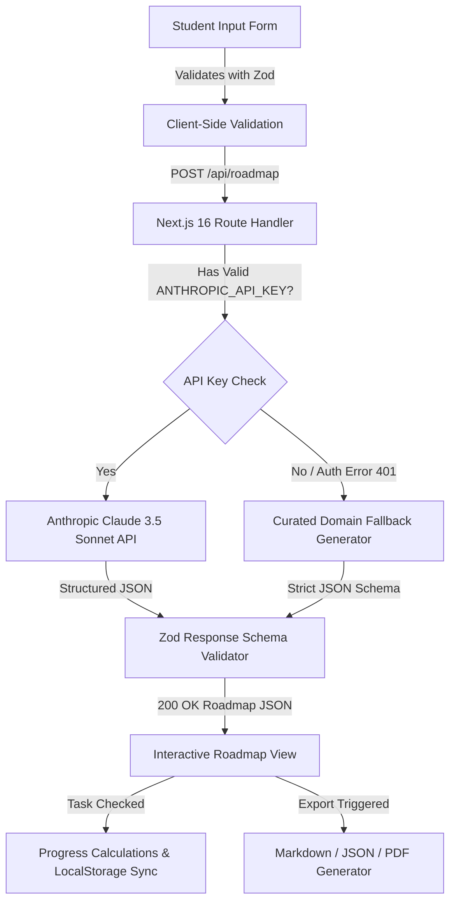

# PathPilot AI — Intelligent Career Roadmap Platform

> **A production-ready, accessible AI-powered career roadmap generator tailored for college students and aspiring software engineers.**

[](https://nextjs.org/)
[](https://react.dev/)
[](https://www.typescriptlang.org/)
[](https://tailwindcss.com/)
[](#accessibility--wcag-21-aa)
[](https://zod.dev/)
[](https://vitest.dev/)

---

## 🎯 Overview & Mission

Most career guidance chatbots output generic conversational paragraphs that lack structure, actionable steps, and time allocation. **PathPilot AI** is fundamentally different:
- **Structured Learning Architecture**: Produces clear sequential phases, estimated hour allocations, portfolio capstone projects, and bite-sized learning tasks.
- **Time & Commitment Budgeting**: Automatically calculates and distributes weekly milestones based on your actual availability (from 2 to 40 hours/week) and target timeline (1 month to 1 year).
- **Interactive Progress Tracking**: Check off tasks, track completed vs remaining study hours, and earn milestone achievement badges with automatic client-side persistence in `localStorage`.
- **WCAG 2.1 AA Accessibility**: Built from the ground up with semantic HTML5 landmarks, screen-reader ARIA live regions, keyboard navigation shortcuts, and high-contrast color systems.
- **Resilient AI Pipeline**: Integrates Anthropic Claude 3.5 Sonnet structured JSON generation with a domain-curated fallback generator to ensure zero breaking downtime.

---

## 🚀 Key Features

| Feature | Description |
| :--- | :--- |
| **Personalized Career Roadmap** | Generates tailored curriculums based on career goal, current prerequisites, and experience level. |
| **Milestone Capstones** | Each phase features a dedicated portfolio project with concrete deliverables and hour estimates. |
| **Interactive Task Checklist** | Mark tasks complete with keyboard (`Space`/`Enter`) or click, updating hours invested and progress in real time. |
| **Curated Free Resources** | High-yield external documentation (MDN, Official Docs, FreeCodeCamp) and practical advisor tips. |
| **Filter & Search** | Filter tasks by type (*Concepts*, *Projects*, *Practice*, *Reading*) or completion status (*Pending*, *Completed*). |
| **Multi-Format Export** | Export your customized path to **Markdown (.md)**, **JSON schema**, clipboard, or print-optimized PDF view. |
| **Persistent State** | Retains your checked tasks, active roadmap, and roadmap history across browser reloads via `localStorage`. |
| **1-Click Career Presets** | Fast-track popular tracks: *Full-Stack Developer*, *AI & LLM Engineer*, *Cloud DevOps*, *Data Scientist*, *Cybersecurity*. |

---

## 🛠️ Technology Stack

- **Framework**: [Next.js 16.3 (App Router)](https://nextjs.org/)
- **Frontend Core**: [React 19.2](https://react.dev/) + [TypeScript 5](https://www.typescriptlang.org/)
- **Styling**: [Tailwind CSS v4](https://tailwindcss.com/) with CSS theme tokens & print stylesheets
- **AI Model**: [Anthropic Claude 3.5 Sonnet](https://www.anthropic.com/) via `@anthropic-ai/sdk`
- **Validation**: [Zod v4](https://zod.dev/) for strict runtime input/output schemas
- **Unit & Component Testing**: [Vitest](https://vitest.dev/) + [React Testing Library](https://testing-library.com/) + [JSDOM](https://github.com/jsdom/jsdom)
- **E2E & Accessibility Testing**: [Playwright](https://playwright.dev/) + [`@axe-core/playwright`](https://github.com/dequelabs/axe-core-npm/tree/develop/packages/playwright)

---

## 🏗️ Architecture & Data Flow



---

## ♿ Accessibility & WCAG 2.1 AA Compliance

PathPilot AI meets all WCAG 2.1 Level AA criteria:
1. **Perceivable**:
   - Contrast ratio exceeds 4.5:1 for normal text and 3:1 for graphical UI elements.
   - Text scaling supported up to 200% without loss of content.
2. **Operable**:
   - Complete keyboard operability (`Tab`, `Shift+Tab`, `Space`, `Enter`, `Escape`).
   - Visible high-contrast focus rings (`outline: 2px solid #6366f1`).
   - Skip-to-content link on initial page focus (`.skip-link`).
3. **Understandable**:
   - Real-time inline form validation messages with `aria-invalid` and `aria-describedby`.
   - Clear input constraints, placeholder hints, and contextual tooltips.
4. **Robust**:
   - Semantic HTML5 structure (`<header>`, `<nav>`, `<main>`, `<section>`, `<article>`, `<fieldset>`, `<legend>`).
   - Dynamic updates announced via `aria-live="polite"` and `role="progressbar"`.
   - Reduced motion queries (`prefers-reduced-motion: reduce`).

---

## 🚦 Getting Started

### 1. Clone & Install Dependencies

```bash
git clone https://github.com/your-username/pathpilot-ai.git
cd pathpilot-ai
npm install
```

### 2. Configure Environment Variables

Copy the example environment configuration:
```bash
cp .env.example .env.local
```

Edit `.env.local` with your Anthropic API Key:
```env
ANTHROPIC_API_KEY=sk-ant-api03-...
```
*(Note: If no API key is provided, PathPilot AI gracefully operates in offline curated mode with 100% feature availability).*

### 3. Run Development Server

```bash
npm run dev
```

Visit [http://localhost:3000](http://localhost:3000) in your browser.

---

## 🧪 Testing Suite

### Run Unit & Component Tests

```bash
npm test
```

### Run Tests in Watch Mode

```bash
npm run test:watch
```

### Run End-to-End & Automated Accessibility (Axe) Audit

```bash
npx playwright install --with-deps
npm run test:e2e
```

---

## 📦 Production Build

```bash
npm run build
npm run start
```

---

## 📄 License & Credits

Built as a Capstone Project by the PathPilot AI Engineering Team. Released under the MIT License.
